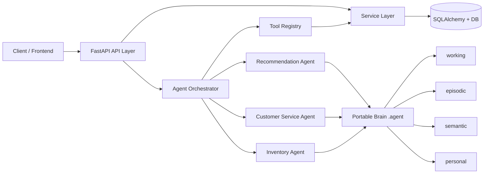
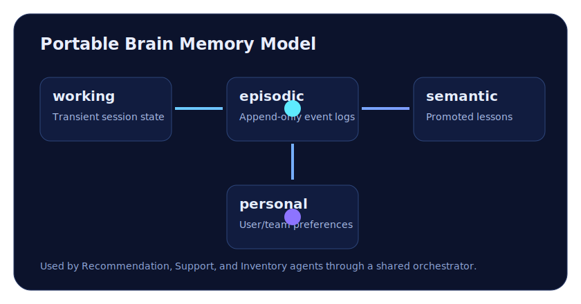

<p align="center">
  
</p>

<h1 align="center">🧠 Agentic Stack: Enterprise Agentic E-Commerce</h1>

<p align="center">
  <strong>A production-inspired FastAPI reference that fuses modern e-commerce architecture with practical Agentic AI patterns.</strong>
</p>

<p align="center">
  
  
  
  
  
  
</p>

---

<a id="hero"></a>

## ✨ Hero: Why this project matters

Most demo projects show either **classic backend engineering** *or* **AI orchestration**.
This repository demonstrates both in one cohesive system:

- 🛒 Real e-commerce flows (catalog, cart, checkout, orders, inventory)
- 🤖 Agent runtime with orchestrator + tool registry
- 🧠 Portable memory model (`.agent/`) for working, episodic, semantic, and personal memory
- 🔍 Observability patterns for both API traffic and agent actions

> If you’re building reliable AI-native products, this repo gives you a practical blueprint.

---

## 📚 Table of Contents

- [✨ Hero: Why this project matters](#hero)
- [🌟 Feature Highlights](#features)
- [🏗️ Architecture at a glance](#architecture)
- [📁 Project structure](#project-structure)
- [🚀 Quick Start](#quick-start)
- [🔌 API surface preview](#api-preview)
- [🧪 Testing](#testing)
- [🧭 GitHub Pages](#github-pages)
- [🗺️ Roadmap](#roadmap)
- [🤝 Contributing](#contributing)
- [📄 License](#license)

---

<a id="features"></a>

## 🌟 Feature Highlights

| Area | What you get |
|---|---|
| ⚡ Backend | FastAPI + SQLAlchemy with clean service-layer boundaries |
| 🔐 Auth | JWT-based login/registration with secure password hashing |
| 🛍️ Commerce | Products, carts, checkout, orders, and inventory controls |
| 🤖 Multi-Agent Runtime | Recommendation, Support, and Inventory agents |
| 🧰 Tooling Pattern | Discoverable internal tools via `ToolRegistry` |
| 🧠 Memory System | Portable brain with `working`, `episodic`, `semantic`, `personal` |
| 📊 Observability | Request middleware + agent event journaling |
| 🧪 Quality | Pytest-based health test coverage |

---

<a id="architecture"></a>

## 🏗️ Architecture at a glance

### System flow (Mermaid)



### Portable brain model

<p align="center">
  
</p>

---

<a id="project-structure"></a>

## 📁 Project structure

```text
app/
  api/routes/           # REST endpoints
  agents/               # abstractions, memory, tools, orchestrator
  core/                 # config, logging, security
  db/                   # engine/session + seed setup
  models/               # SQLAlchemy entities
  schemas/              # Pydantic request/response DTOs
  services/             # business logic layer
.agent/
  working/              # transient task/session state
  episodic/             # append-only event journals
  semantic/             # promoted lessons/patterns
  personal/             # user/team preferences
```

---

<a id="quick-start"></a>

## 🚀 Quick Start

### 1) Setup environment

```bash
python3 -m venv .venv
source .venv/bin/activate
pip install -e ".[dev]"
cp .env.example .env
```

### 2) Run the API

```bash
uvicorn app.main:app --reload
```

Useful local endpoints:

- Swagger UI: `http://127.0.0.1:8000/docs`
- Health: `http://127.0.0.1:8000/health`

> **Note:** This localhost refers to localhost of the Abacus AI Agent computer that I'm using to run the application, not your local machine. To access it locally or remotely, you'll need to deploy the application on your own system and run it locally.

### 3) Seeded default user

- Email: `admin@agentic-commerce.local`
- Password: `admin123`

---

<a id="api-preview"></a>

## 🔌 API surface preview

### Core commerce

- `GET /api/v1/products/`
- `POST /api/v1/cart/items`
- `POST /api/v1/orders/checkout`
- `GET /api/v1/inventory/{product_id}`

### Auth

- `POST /api/v1/auth/register`
- `POST /api/v1/auth/login`

### Search & recommendations

- `GET /api/v1/search/products?q=laptop`
- `GET /api/v1/search/recommendations`

### Agent endpoints

- `GET /api/v1/agents/recommend`
- `POST /api/v1/agents/support?message=where+is+my+order`
- `GET /api/v1/agents/inventory/{product_id}`

---

<a id="testing"></a>

## 🧪 Testing

```bash
pytest -q
```

Run this test before opening a PR to keep the baseline healthy.

---

<a id="github-pages"></a>

## 🧭 GitHub Pages

A polished project site is available under [`docs/`](docs/) with:

- Hero + project story
- Architecture visualization
- Feature showcase
- Getting started guide
- API preview
- Article and research references

Once GitHub Pages is enabled for **`main` branch / `docs` folder**, your site URL will be:

`https://arjun-basu001.github.io/agentic-stack/`

---

<a id="roadmap"></a>

## 🗺️ Roadmap

- [ ] Move SQLite to managed Postgres
- [ ] Add Alembic migrations
- [ ] Add async workers for order workflows
- [ ] Expand observability with OpenTelemetry
- [ ] Add richer test suites (integration + contract)

---

<a id="contributing"></a>

## 🤝 Contributing

Contributions are welcome! 🎉

1. Fork the repo
2. Create a branch: `feature/your-change`
3. Commit your updates with clear messages
4. Run tests locally: `pytest -q`
5. Open a pull request with:
   - context/problem statement
   - approach/implementation summary
   - screenshots or sample API calls when relevant

Please keep route handlers thin and place business logic in `app/services` to preserve architecture consistency.

---

## 📖 More documentation

- [Architecture deep dive](./ARCHITECTURE.md)
- [Agent development guide](./AGENT.md)
- [Project site (GitHub Pages)](./docs/index.html)

---

<a id="license"></a>

## 📄 License

This project is licensed under the [MIT License](./LICENSE).
